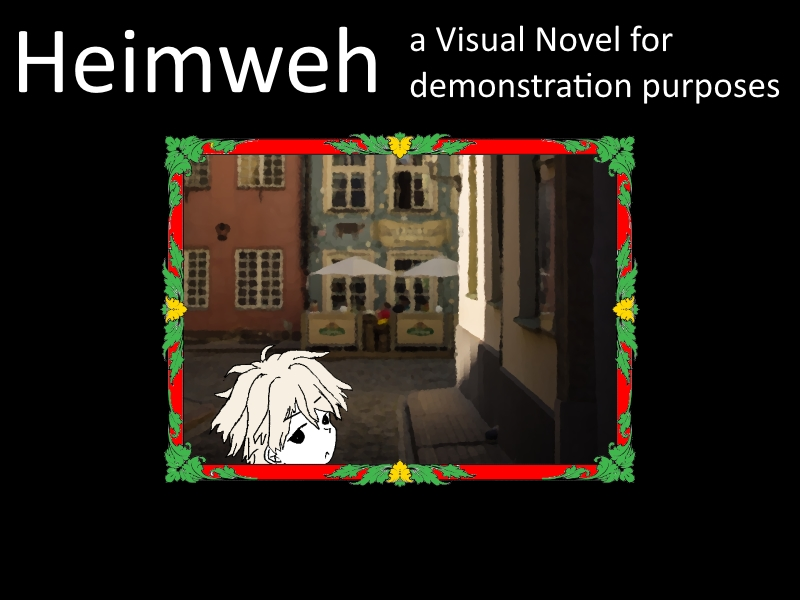

# Heimweh

Heimweh is a Visual Novel that was created via RenPy in 2016 as a Bachelor project.
This project was endorsed and motivated by the University of Heidelberg in cooperation with the Mannheim University of Applied Sciences.

# Synopsis
Heiden is a small boy who lived happily with his single mother in the hustle and bustle of the big city. However, that changed with the sudden passing of his mother as he decided to move into the household of his uncle, who lived pretty far out in the modest province.
Follow Heiden as he tries to find a new life together with a seemingly strange uncle and the peculiar people of the village while coping the loss of his mother.
Will Heiden find the time and patience to piece together the past of his mother and what happened to his unknown father?
